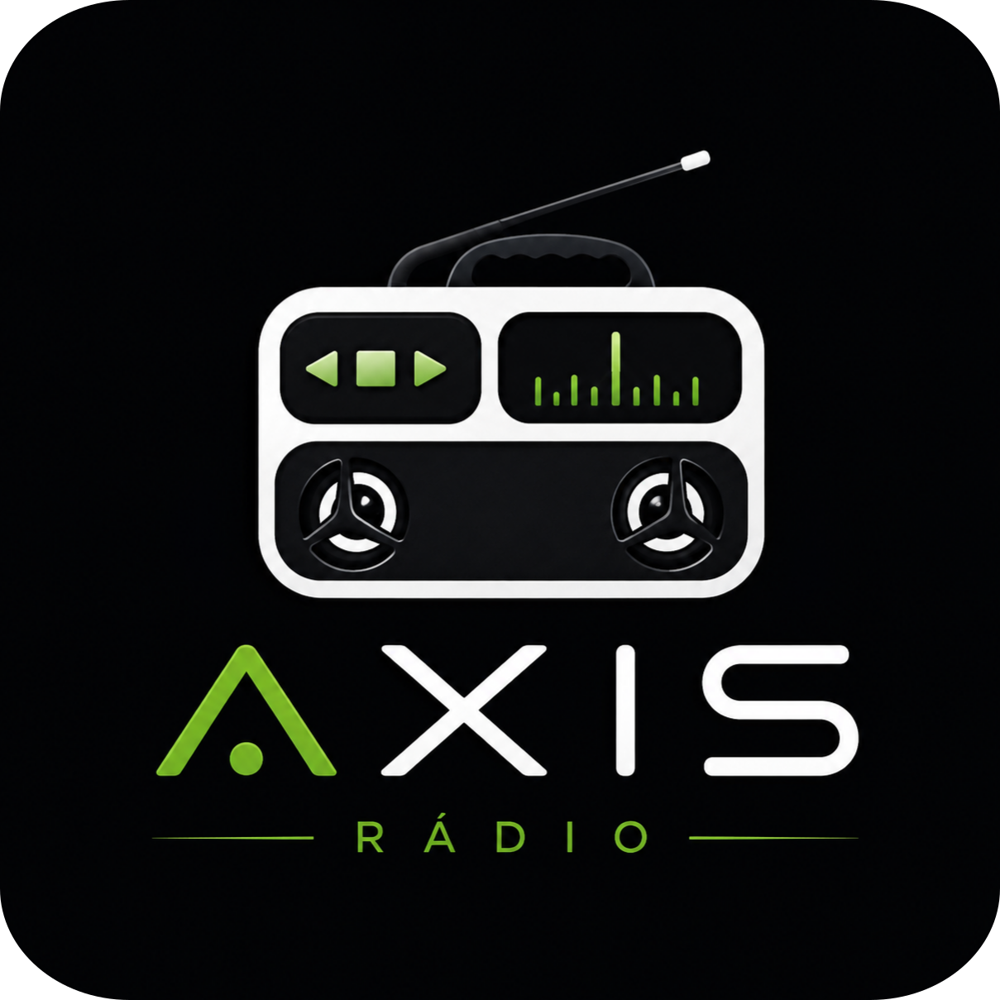
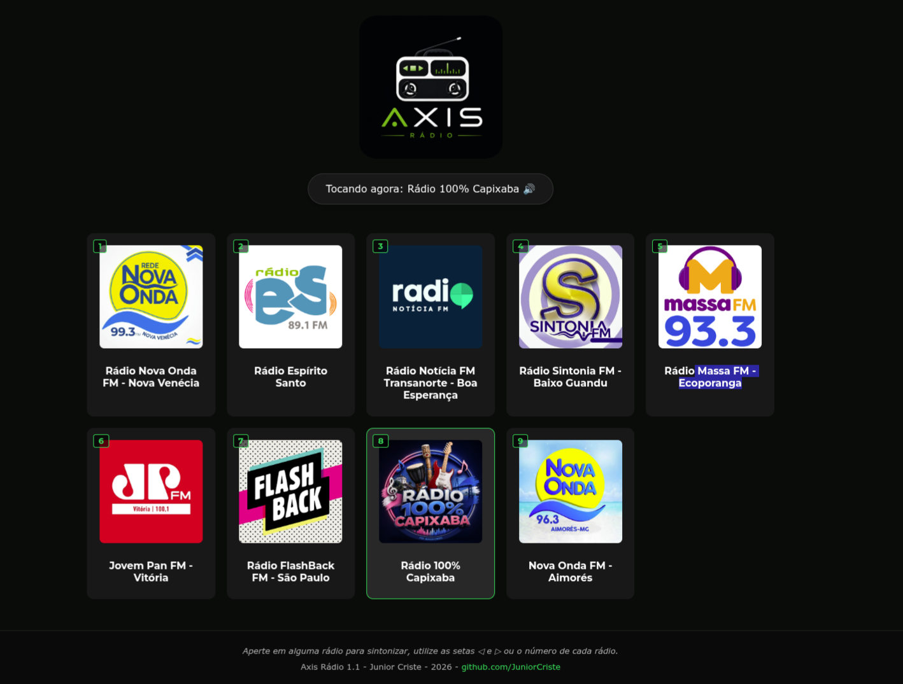

# <p align="center"></p>

# Axis Rádio `v1.1`

O **Axis Rádio** é uma aplicação web de alta performance desenvolvida para unificar o streaming das principais estações de rádio do Espírito Santo (e além) em uma interface limpa, rápida e totalmente controlável por hardware. Projetado sob medida para rodar em modo **Kiosk (Chromium)** e telas interativas de automação.

🌐 **Acesse agora mesmo:** [juniorcriste.github.io/LocalRadio/](https://juniorcriste.github.io/LocalRadio/)

---

## 🚀 O que há de novo?

* 🔇 **Adeus, Sintetizador de Voz:** Toda a interação por voz utiliza locuções reais em arquivos de áudio de alta fidelidade (`.ogg`), garantindo compatibilidade uniforme entre navegadores sem depender de engines de terceiros.
* 🛡️ **Filtro Anti-Bloqueio (Safe Play):** Implementação de um ecossistema inteligente de *fallback*. Se o navegador bloquear o autoplay, o app avisa visualmente e destrava com um único clique ou toque.
* 🖼️ **Suporte Híbrido (Streaming + Web Player):** Além do player de áudio nativo, o sistema suporta integração via `iframe` com comunicação `postMessage` para web rádios externas.
* 📶 **Reconexão Silenciosa:** Se o sinal oscilar, o sistema tenta restabelecer o link em segundo plano por até 8 segundos antes de emitir o alerta visual e sonoro de falta de sinal.
* ⌨️ **Navegação e Controle por Hardware:** Mapeamento completo para teclas numéricas (1 a 9 / NumPads) e navegação sequencial através das setas direcionais (◀ / ▶).

---

## 🎛️ Estações Pré-Configuradas

| Slot | Emissora | Região/Foco | Tipo |
| :---: | :--- | :--- | :---: |
| **1** | 📻 Rádio Nova Onda FM | Nova Venécia / ES | Direct Stream |
| **2** | 🏛️ Rádio Espírito Santo | Vitória / ES (Governo) | Direct Stream |
| **3** | 📰 Rádio Notícia Transanorte FM | Boa Esperança / ES | Direct Stream |
| **4** | 🎵 Rádio Sintonia FM | Baixo Guandu / ES | Direct Stream |
| **5** | 🚜 Rádio Massa FM | Ecoporanga / ES | Direct Stream |
| **6** | ⚡ Rádio Jovem Pan FM | Vitória / ES | Direct Stream |
| **7** | 📼 Rádio FlashBack FM | São Paulo / SP | Direct Stream |
| **8** | 🎙️ Rádio 100% Capixaba | Espírito Santo | Web Player (Iframe) |
| **9** | 📻 Nova Onda FM | Aimorés / MG | Direct Stream |

---

## 🕹️ Atalhos de Teclado

| Tecla / Atalho | Função |
| :--- | :--- |
| **`1` a `9`** | Sintoniza diretamente a rádio do slot correspondente |
| **`➔` (Seta Direita)** | Avança para a próxima rádio |
| **`⬅` (Seta Esquerda)** | Voltar para a rádio anterior |


---

## 🛠️ Arquitetura do Sistema

O projeto foi inteiramente desacoplado e modularizado para facilitar manutenções futuras:

```bash
LocalRadio/
├── index.html     # Esqueleto estrutural sem scripts embutidos
├── style.css      # Customização visual responsiva (Dark Theme)
├── app.js         # Core Engine: filas de áudio, handlers e conexões
├── img/           # Identidade visual, logo e ícones das emissoras
└── voice/         # Pack de locuções locais em formato .ogg
```

---
# <p align="center"></p>

---
## 👤 Desenvolvedor

Desenvolvido por **Junior Criste** 🚀  
Sinta-se à vontade para contribuir, relatar problemas ou enviar sugestões no repositório!  
🔗 **GitHub:** [JuniorCriste](https://github.com/JuniorCriste)